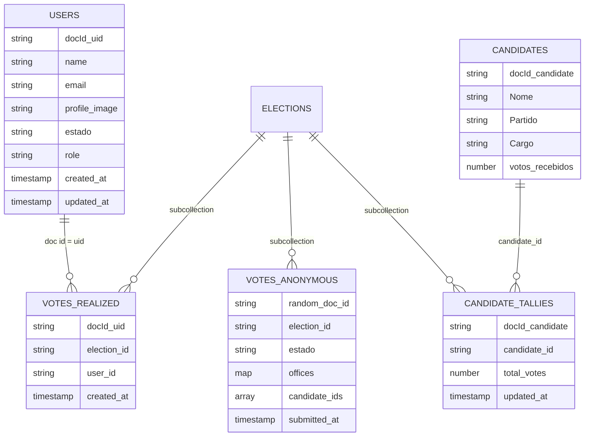

# Modelo Firestore para voto anonimizado e bloqueio de voto único

Este projeto usa Firestore com separação por responsabilidade para preservar anonimato e integridade. A regra principal é: o documento do usuário nunca armazena candidato escolhido e o documento de voto não contém `uid`, email ou outro identificador do eleitor.

## Coleções

## Caminhos Firestore

- `users/{uid}`: identidade e estado do eleitor. Nao recebe `candidatos_escolhidos`.
- `elections/{electionId}/votes_realized/{uid}`: lock de voto unico (controle anti-duplo voto).
- `elections/{electionId}/votes_anonymous/{randomVoteId}`: voto anonimo sem `uid`.
- `elections/{electionId}/candidate_tallies/{candidateId}`: totalizacao por candidato.
- `candidatos/{candidateId}`: contador agregado (`votos_recebidos`) para leitura de ranking.
- `elections/{electionId}/audit_events/{eventId}`: evento tecnico de confirmacao da transacao.
- `elections/{electionId}/eligibility/{uid}`: legado (somente leitura para eleitor, escrita admin).

## Fluxo implementado no app

1. Login com Firebase Auth identifica o eleitor.
2. `UserProvider` cria/atualiza `users/{uid}` com perfil minimo e remove campos legados sensiveis.
3. As escolhas ficam em `localStorage` durante o fluxo de UI (nao no documento do usuario).
4. Ao finalizar, `castAnonymousVote()` executa uma transacao unica:
   - verifica se `votes_realized/{uid}` ja existe;
   - cria `votes_realized/{uid}` com lock por `uid`;
   - grava `votes_anonymous/{voteId}` sem identificador do eleitor;
   - incrementa `candidatos/{id}.votos_recebidos`;
   - incrementa `candidate_tallies/{id}.total_votes`;
   - grava `audit_events/{eventId}`.
5. A tela de resultado usa recibo local + leitura dos candidatos por `candidate_ids`.

## Garantias de segurança aplicadas

- Anti-duplo voto: lock em `votes_realized/{auth.uid}`.
- Anonimato no voto: `votes_anonymous` nao aceita campo de identidade.
- Integridade de contagem: regras exigem que lock + voto anonimo + incrementos ocorram no mesmo commit atomico.
- Sigilo entre usuarios: eleitor comum nao le votos anonimos nem lock de outros usuarios.

## Regra de projeção dos gráficos percentuais

Os graficos de chance usam `src/services/candidateMetrics.js` nas telas de selecao e resultado.

- Votos considerados: `votos_recebidos` e aliases equivalentes.
- Media de referencia: campo do candidato com media historica; se ausente usa variaveis `VITE_PROJECTION_AVG_DEPUTADO_FEDERAL`, `VITE_PROJECTION_AVG_SENADOR` ou fallback do MVP.
- Formula: `percentual = clamp((votos / media_de_referencia) * 100, 0, 100)`.
- Valores invalidos (`-`, string, virgula decimal etc.) sao normalizados antes do calculo.
- Quando usa fallback do MVP, `projectionReliable` fica `false`.

## Observação de segurança

O modelo remove o vinculo direto `UserID -> CandidateID` na base operacional. Para elevar sigilo contra correlacao por horario de escrita em logs de infraestrutura, o proximo passo recomendado e mover `castAnonymousVote()` para Cloud Functions com assinatura server-side e trilha de auditoria separada.
