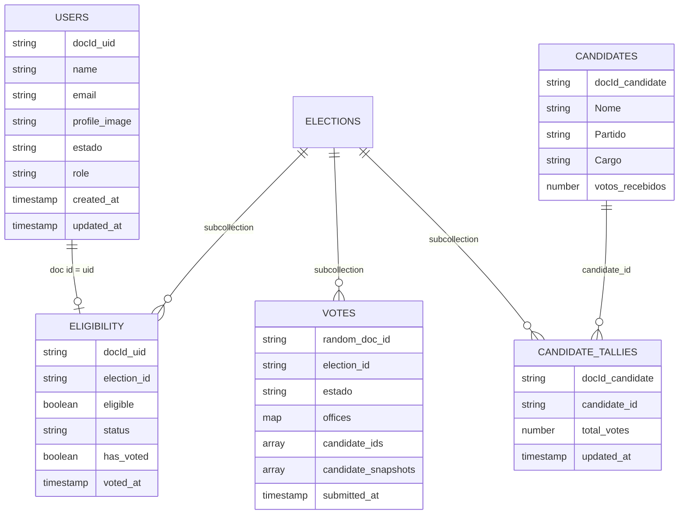

# Modelo Firestore para voto sem vínculo direto com o eleitor

Este projeto usa Firestore, então o modelo foi separado em coleções por responsabilidade. A regra principal é: o documento do usuário nunca armazena candidato, partido, cargo escolhido ou histórico de voto.

## Coleções



## Caminhos Firestore

- `users/{uid}`: identidade e estado do eleitor. Não recebe `candidatos_escolhidos`.
- `elections/{electionId}/eligibility/{uid}`: controla se o eleitor está habilitado e se já votou. Não contém candidato.
- `elections/{electionId}/votes/{randomVoteId}`: voto anônimo com candidatos escolhidos. Não contém `uid`, nome ou e-mail.
- `elections/{electionId}/candidate_tallies/{candidateId}`: totalização por candidato.
- `elections/{electionId}/audit_events/{eventId}`: eventos técnicos sem candidato e sem identidade direta.

## Fluxo implementado no app

1. Login com Firebase Auth identifica o eleitor.
2. `UserProvider` cria/atualiza `users/{uid}` apenas com perfil mínimo e remove `candidatos_escolhidos` se existir.
3. A escolha de candidatos durante a navegação fica em `localStorage`, vinculada apenas ao navegador local, não ao Firestore.
4. Ao finalizar a escolha dos senadores, `castAnonymousVote()` executa uma transação Firestore:
   - lê `elections/{electionId}/eligibility/{uid}`;
   - bloqueia se `has_voted` já for `true`;
   - cria `elections/{electionId}/votes/{randomVoteId}` sem `uid`;
   - marca `has_voted: true` no documento de elegibilidade;
   - incrementa a totalização dos candidatos.
5. A tela de resultado lê o rascunho/recibo local para exibir a nota. Ela não busca voto por `uid`.

## Modo de avaliação e modo produção

O serviço usa `VITE_ALLOW_SELF_ENROLLMENT !== 'false'` para permitir que o app de avaliação crie a habilitação do eleitor quando ela ainda não existe. Para produção, defina:

```env
VITE_ALLOW_SELF_ENROLLMENT=false
```

Com essa configuração, a coleção `elections/{electionId}/eligibility/{uid}` deve ser pré-carregada por processo administrativo confiável.

## Observação de segurança

Este modelo remove o vínculo direto `UserID -> CandidateID` do Firestore. Para sigilo eleitoral absoluto contra administradores com acesso a logs, o próximo passo deve ser mover `castAnonymousVote()` para uma Cloud Function callable com emissão de token cego ou outra separação criptográfica entre autenticação e urna. O front-end sozinho não consegue impedir correlação por horário de escrita nos logs da infraestrutura.
