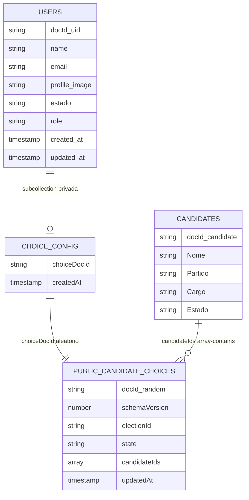

# Modelo Firestore para escolhas e viabilidade

Este projeto usa Firestore sem Cloud Functions para salvar escolhas ativas e calcular viabilidade. A regra principal é: cada usuário autenticado tem apenas um documento público de escolhas, identificado por um ID aleatório que não é o UID.

## Coleções



## Caminhos Firestore

- `users/{uid}`: identidade minima do eleitor. Nao recebe lista de candidatos.
- `users/{uid}/private/choiceConfig`: documento privado com `choiceDocId` aleatorio.
- `publicCandidateChoices/{choiceDocId}`: escolha publica ativa, com `state` e `candidateIds`.
- `candidatos/{candidateId}`: dados publicos dos candidatos.
- `elections/{electionId}/ballot_drafts/{uid}`: legado, somente leitura do dono para migracao suave.
- `elections/{electionId}/candidate_tallies/{candidateId}`: legado/admin; o app novo calcula viabilidade com `count()`.

## Fluxo implementado

1. Login com Firebase Auth identifica o usuario.
2. Ao salvar pela primeira vez, o app cria `users/{uid}/private/choiceConfig` com um `choiceDocId` aleatorio.
3. O app grava as escolhas em `publicCandidateChoices/{choiceDocId}`.
4. O rascunho completo com snapshots dos candidatos continua em `localStorage` para navegação rapida.
5. Ao mudar de estado, o app sobrescreve o documento publico com o novo `state` e `candidateIds: []`.
6. Ao escolher/remover candidato, o app sobrescreve o mesmo documento com os IDs ativos.

## Regras de contagem

A viabilidade usa agregacao de leitura do Firestore:

```js
count(
  publicCandidateChoices
    .where('electionId', '==', ACTIVE_ELECTION_ID)
    .where('state', '==', candidateState)
    .where('candidateIds', 'array-contains', candidateId)
)
```

Formula:

```txt
viabilidadePercent = min((usuariosQueSelecionaram / mediaVotosEleitos) * 100, 100)
```

No teste atual, `mediaVotosEleitos = 4`.

## Garantias

- Um usuario nao cria dois documentos publicos, porque o `choiceDocId` fica fixo no documento privado.
- O mesmo candidato nao aparece duplicado no app, porque o servico normaliza IDs unicos antes de salvar.
- O fluxo exige pelo menos 1 deputado federal e 2 senadores para avançar, mas a seleção pode ter mais candidatos.
- Mudanca de estado zera a lista publica, entao escolhas antigas deixam de contar automaticamente.

## Limite de privacidade

O ID publico aleatorio reduz o vinculo direto com o UID, mas nao e anonimato forte. Como o frontend usa `count()` direto no Firestore, as regras precisam permitir leitura de `publicCandidateChoices`. Para sigilo forte no futuro, a contagem agregada deve voltar para um backend confiavel ou outro mecanismo que nao exponha documentos de escolha.

## Deploy necessario

Depois da alteracao, publique regras e indices:

```bash
firebase deploy --only firestore:rules,firestore:indexes
```
